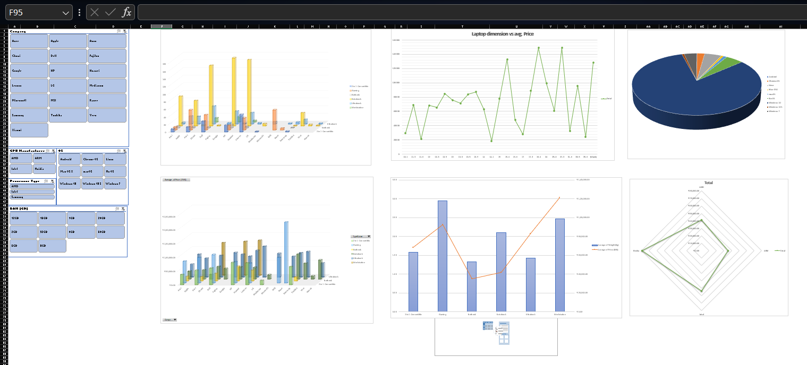

# Excel_data_analysis
Great! Here's an updated README specifically tailored for the 'project.xlsx' file:

---

# Laptop Dataset Analysis Project

## Overview
This Excel project involves comprehensive analysis and visualization of a laptop dataset ('project.xlsx'). The dataset encompasses unclean data, cleaned data, insights, pivot tables, and a dashboard related to various laptop specifications such as company, type, screen size, processor details, memory, OS, weight, and price (in INR).

## Dataset Details
- **Filename**: laptop.xlsx
- **Columns**:
  - Serial No.
  - Company
  - TypeName
  - Inches
  - Screen Resolution
  - Processor Type
  - Processor Model
  - Base Clock Speed (GHz)
  - RAM (GB)
  - Memory
  - GPU Manufacturer
  - GPU Model
  - OS
  - Weight (Kg)
  - Price (INR)

## Files Included
- **laptop.xlsx**
- **project.xlsx**: Main Excel file containing multiple sheets:
  - **Unclean Data Sheet**: Initial dataset requiring cleaning from  **laptop.xlsx**
  - **Cleaned Data Sheet**: Dataset post-cleaning and standardization
  - **Insight Data Sheet**: Contains generated insights from the cleaned data
  - **Pivot Sheet**: Includes pivot tables for analysis
  - **Dashboard Sheet**: Visual representation of key insights

## Activities Undertaken
1. **Data Cleaning**:
   - Handling empty cells via color-coding
   - Segregation of columns for obtaining additional information
   - Standardization of columns with their designated datatypes
   - Sorting the dataset for clarity

2. **Generated Insights**:
   - Count of laptop types for each company using filters
   - Descriptive statistics of price for each company and laptop type (Average, Sum, Max, Min, Std Dev, Var)
   - Range of weight for each type and company with various filters
   - Average weight of laptops company-wise and filtered by type
   - Analysis of RAM sizes and their counts
   - Distribution of OS types and their count
   - Processor type and count of processor models
   - Processor type and the range of base clock speed with processor model as a filter
   - Number of laptop types and their prices for each RAM size, filtered by company and OS

3. **Pivot Tables**:
   - Laptop screen dimensions in inches and their average price
   - Company, laptop type, average price, and count
   - Average price and weight for different laptop types
   - GPU manufacturer and their average GPU price with GPU model as a filter
   - Count of laptop types for each OS

4. **Dashboard**:
   - Visual representations of key insights via graphs:
     - Line graph for laptop screen dimension vs. average price
     - 3D bar graph displaying company, laptop type, and their average price
     - 3D bar graph showcasing company, laptop type, and their count
     - Combo chart (bar and line) for laptop type, average price, and average weight
     - Radar chart depicting GPU manufacturer and their average GPU price with GPU model as a filter
     - Pie chart illustrating the count of laptop types for each OS

       

## Note
Ensure all sheets in 'project.xlsx' retain necessary functions and formatting for proper functionality of pivot tables and the dashboard.

---
